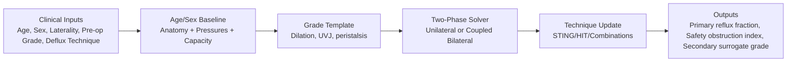
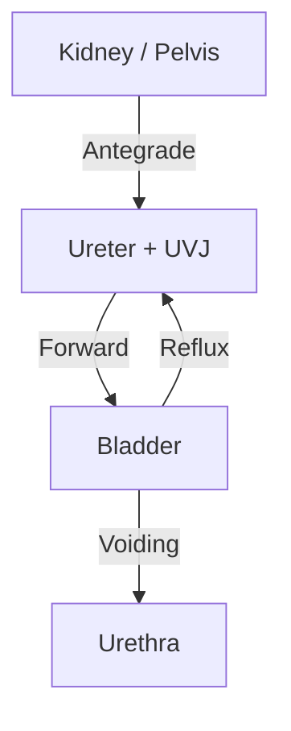
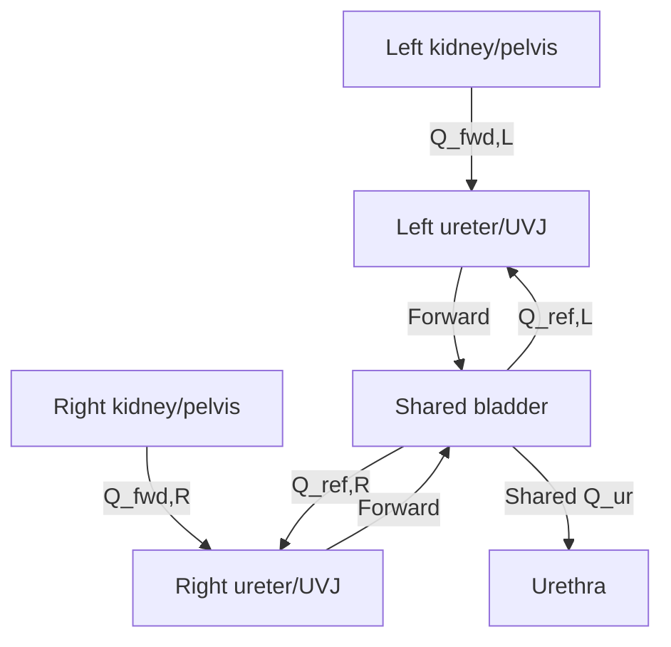

# Methods for Pediatric Urology Audience (Parameter-Explicit)

## Purpose
This section describes how the VUR simulation was built and exactly which numeric values were used, with source mapping for clinical review. The model is a reduced-order, time-resolved pressure-flow simulator (not a full 3D CFD mesh solver), designed for rapid scenario testing and cohort calibration in pediatric VUR/Deflux studies. The current implementation supports unilateral and coupled bilateral runs (single shared bladder state), UVJ deformation-aware resistance scaling, and BBD-aware bladder/outlet perturbations.

## 1) Core model structure
The urinary tract is represented by 4 coupled compartments:
- renal pelvis/kidney,
- ureter + UVJ valve,
- bladder,
- urethra.

Each time step computes:
- antegrade ureteral flow (kidney to bladder),
- retrograde reflux flow (bladder to kidney),
- urethral outflow during voiding.

The bladder cycle is explicitly two-phase:
- filling duration: 8.0 s,
- voiding duration: 4.0 s.

### 1.1 Bilateral coupling implementation
When `laterality = bilateral`, the model solves left and right ureters simultaneously with:
- one shared bladder pressure-volume trajectory,
- one shared urethral outflow term,
- side-specific UVJ/anatomy/peristalsis states,
- left and right peristaltic waves phase-offset by half a cycle (0.5), modeling the physiologic asynchrony of bilateral ureteral contractions.

Shared-state construction:
- baseline bladder pressure = mean(left, right),
- end-filling and peak-voiding pressure = max(left, right),
- initial bladder volume = mean(left, right),
- full bladder capacity = mean(left, right),
- urethral resistance = mean(left, right).

The bladder update uses summed side flows per time step:
- antegrade sum = left antegrade + right antegrade,
- reflux sum = left reflux + right reflux,
- bladder volume update uses (antegrade sum - reflux sum - shared urethral outflow).

## 2) Age- and sex-specific anatomy values used
Values below are directly used in code (`AGE_ANATOMY_PROFILES`).

| Age group | Ureter diameter (mm) | Ureter length (mm) | UVJ orifice diameter (mm) | Female urethra length (mm) | Male urethra length (mm) | Source IDs |
|---|---:|---:|---:|---:|---:|---|
| 12_18m | 3.25 | 132.5 | 1.30 | 23.5 | 94.0 | C1, C2, C3, C4, C5 |
| 18_24m | 3.30 | 137.5 | 1.40 | 23.1 | 97.0 | C1, C2, C3, C4, C5 |
| 24_60m | 3.50 | 155.0 | 1.60 | 26.0 | 106.0 | C1, C2, C3, C4, C5 |
| 5_10y | 4.00 | 195.0 | 1.90 | 28.0 | 128.0 | C1, C2, C3, C4, C5 |
| 10_16y | 4.70 | 250.0 | 2.30 | 32.0 | 158.0 | C1, C2, C3, C4, C5 |

## 3) Pressure profiles used
Values below are used in `AGE_PRESSURE_PROFILES` and converted to Pa using 1 cmH2O = 98.0665 Pa.

| Age group | Filling baseline (cmH2O) | Filling end (cmH2O) | Peak voiding female (cmH2O) | Peak voiding male (cmH2O) | Source IDs |
|---|---:|---:|---:|---:|---|
| 12_18m | 5.0 | 10.0 | 75.0 | 90.0 | C6, C7, C8, C9 |
| 18_24m | 5.0 | 10.0 | 60.0 | 75.0 | C6, C7, C8, C9 |
| 24_60m | 4.5 | 10.0 | 55.0 | 70.0 | C6, C9 |
| 5_10y | 4.0 | 10.0 | 50.0 | 65.0 | C6, C9 |
| 10_16y | 4.0 | 10.0 | 45.0 | 60.0 | C6, C9 |

## 4) Bladder capacity formulas used
The simulator now uses one unified capacity equation for all supported ages:
- `koff`:
  - `Vcap (mL) = (age_years + 2) x 30`.

Capacity is clamped to 30-700 mL.

Source IDs: C13, C14, C15.

## 5) VUR grade template values used
The pre-op grade template (`0-5`) is applied before any technique.

### 5.1 Grade template multipliers
| Grade | Competence | Reverse resistance x | Barrier x | Voiding pressure x | Ureter dilation x | Tortuosity index baseline | Compliance x | Peristalsis efficiency x |
|---|---:|---:|---:|---:|---:|---:|---:|---:|
| 0 | 0.97 | 18.0 | 3.2 | 0.90 | 1.00 | 1.00 | 0.95 | 1.05 |
| 1 | 0.85 | 12.0 | 2.5 | 1.00 | 1.02 | 1.00 | 1.00 | 1.00 |
| 2 | 0.68 | 7.0 | 1.9 | 1.10 | 1.05 | 1.00 | 1.08 | 0.95 |
| 3 | 0.48 | 4.2 | 1.3 | 1.30 | 1.25 | 1.00 | 1.20 | 0.85 |
| 4 | 0.30 | 2.4 | 0.90 | 1.60 | 1.55 | 1.10 | 1.35 | 0.70 |
| 5 | 0.15 | 1.2 | 0.60 | 2.00 | 2.05 | 1.75 | 1.55 | 0.50 |

Source ID: C16 (morphology trend), with template coefficients used as internal calibration constants.
`Voiding pressure x` is retained as a legacy infant-only switch and is inactive in current runs (0-12 months are excluded).

### 5.2 Grade-standard peristalsis settings
Peristalsis uses a smooth raised-cosine waveform with power-shaping and a 15% tonic baseline floor (fraction of amplitude). The waveform oscillates continuously without hard-zeroing between contractions, modeling physiologic ureteral tone.

| Grade | Frequency (Hz) | Amplitude (Pa) |
|---|---:|---:|
| 0 | 0.90 | 230 |
| 1 | 0.85 | 210 |
| 2 | 0.80 | 195 |
| 3 | 0.72 | 170 |
| 4 | 0.62 | 145 |
| 5 | 0.52 | 115 |

Amplitudes are calibrated for the smooth raised-cosine waveform (which has a higher mean than an equivalent duty-cycled pulse) to preserve aggregate reflux fraction behavior across grades.

Source IDs: C12, C18 (physiologic context), with exact values set as model defaults for reproducibility.

## 6) Tissue/flow constants and clamps used
- Fluid density: 1050.0 kg/m3.
- Fluid viscosity: 0.0010 Pa*s.
- Baseline renal pelvis pressure: 7.0 cmH2O.
- Baseline renal pelvis volume: 8.0 mL.
- Urine production: 0.03 mL/s.
- Urethral resistance scale: 3900.0.
- Ureter resistance reference constants:
  - reference resistance 90.0,
  - reference length 137.5 mm,
  - reference diameter 3.3 mm.

Relevant source IDs: C10, C11, C12, C19, C20 (contextual grounding).

Additional pelvis compliance parameters:
- Pelvis stiffening alpha: 0.25.
- Pelvis stiffening volume threshold: 12.0 mL.
- Pelvis pressure formula: `P = P_baseline + (V - V0)/C_eff * (1 + alpha * max(V - V_threshold, 0))`.
- At low pelvis volumes, compliance is approximately linear. Beyond the threshold, progressive stiffening prevents unrealistically low peak pressures in high-reflux (grade IV-V) scenarios, consistent with Whitaker perfusion study observations.

### 6.1 Deformation-aware UVJ resistance update
At each timestep, UVJ resistance is scaled from bladder-wall deformation state (reference near 10% capacity):
- UVJ geometry modeled as elliptical section with major/minor radii and intramural length,
- resistance uses elliptical Poiseuille extension:
  - `R ~ l*(a^2+b^2)/(a^3*b^3)`,
- forward/reverse UVJ resistance multipliers and barrier gain are updated from this geometry [C21].

Additionally, retrograde flow exerts pressure on the UVJ from the ureteral side (reflux feedback), potentially further opening the junction:
- `reflux_stretch = clamp(Q_reflux * R_uvj_reverse / 2000.0, 0, 1)`,
- `susceptibility = 0.15 * (1 - competence)`,
- `minor_scale *= (1 + susceptibility * reflux_stretch)`, clamped to `[0.24, 1.55]`.
- This positive feedback loop is most active in high-grade (low-competence) junctions and negligible at grades 0-I.

### 6.2 BBD profile parameters used
| BBD profile | Baseline pressure gain | Filling pressure gain | Voiding pressure gain | Filling spike amplitude | Filling spike frequency | Outlet resistance gain | Min residual fraction |
|---|---:|---:|---:|---:|---:|---:|---:|
| none | 0.00 | 0.00 | 0.00 | 0 cmH2O | 0.00 Hz | 1.00 | 0.00 |
| overactive | 0.08 | 0.22 | 0.12 | 18 cmH2O | 0.45 Hz | 1.15 | 0.08 |
| dysfunctional_voiding | 0.05 | 0.12 | 0.24 | 9 cmH2O | 0.30 Hz | 1.80 | 0.22 |
| mixed | 0.10 | 0.28 | 0.30 | 24 cmH2O | 0.50 Hz | 2.10 | 0.30 |

`bbd_severity` scales these effects linearly from 0.0 to 1.0. Filling spikes use a smooth raised-cosine waveform (with 0.70 amplitude scaling to compensate for the higher mean vs the previous half-wave rectified form). Clinical rationale: BBD increases recurrent UTI risk and worsens reflux outcomes, and includes both storage and emptying dysfunction mechanisms [C22, C23, C24].

## 7) Deflux technique parameterization used
Current technique set (Deflux-only mode):
- STING,
- HIT,
- Double HIT,
- HIT + STING,
- Double HIT + STING.

### 7.1 Site model
- STING: 1 site.
- HIT: 1 site.
- Double HIT: 2 sites (50/50 split).
- HIT + STING: 2 sites (50/50 split).
- Double HIT + STING: 3 sites (1/3 each).

### 7.1a Site placement geometry used
| Technique/site | Wall plane | Clockface | Axial fraction | Interpretation |
|---|---|---:|---:|---|
| STING | submeatal | 6 | 0.08 | Distal submeatal mound at ureteral meatus |
| HIT | detrusor_tunnel | 6 | 0.34 | Intraureteric mound within intramural detrusor tunnel |
| Double HIT distal site | detrusor_tunnel | 6 | 0.30 | Distal intramural intraureteric mound near meatus |
| Double HIT superior site | detrusor_tunnel | 6 | 0.56 | More proximal intramural intraureteric mound |

Combination techniques reuse these placements and split total injected volume by site fraction.

### 7.2 Coefficients by component (physics-oriented internal calibration constants)
| Component | Affected-length fraction | Displacement efficiency | Reverse dynamic gain | Barrier gain scale (Pa) | Competence gain scale | Forward edema penalty |
|---|---:|---:|---:|---:|---:|---:|
| STING | 0.45 | 0.20 | 0.18 | 1800 | 0.22 | 0.08 |
| HIT | 0.68 | 0.28 | 0.32 | 2600 | 0.31 | 0.12 |
| Double HIT | 0.88 | 0.34 | 0.46 | 3300 | 0.40 | 0.18 |

Placement quality is modeled from 0.0 to 1.0 (default 0.75) and affects both efficacy and outlet narrowing effects.

### 7.3 Bilateral side-specific technique inputs
In bilateral mode, each side has independent:
- technique selection,
- Deflux volume (mL),
- placement quality.

The model applies each side's technique transform before coupled bilateral flow integration. This allows combinations such as:
- left: HIT, right: Double HIT + STING,
- left/right with different volumes and placement quality values.

## 8) Obstruction and reflux outcome definitions
### 8.1 Primary efficacy endpoint: reflux fraction
Reflux fraction = reflux volume / (reflux volume + antegrade volume), reported total and by phase.

### 8.2 Secondary classifier: surrogate post-op grade
Derived from weighted score using:
- total reflux fraction (weight 0.55),
- peak renal pelvis pressure (weight 0.20),
- filling reflux fraction (weight 0.25).

Bin thresholds: `<0.05 -> 0`, `<0.12 -> 1`, `<0.25 -> 2`, `<0.37 -> 3`, `<0.45 -> 4`, `>=0.45 -> 5`.

### 8.3 Co-primary safety endpoint: obstruction index (normalized weights)
Obstruction index is computed as:
- 0.533 x pressure risk
- 0.133 x low-forward-flow fraction
- 0.100 x low-voiding-outflow fraction
- 0.034 x tortuosity risk
- 0.200 x edema risk (UVJ forward-resistance multiplier proxy)

Weights are normalized to sum to 1.0 (relative ratios 16:4:3:1:6 preserved from the original design).

For BBD scenarios, obstruction outputs are reported from a BBD-neutral reference run (BBD disabled) to avoid attributing functional bladder behavior to mechanical UVJ obstruction risk.

Pressure thresholds:
- obstruction-pressure threshold: 30 cmH2O,
- severe threshold: 45 cmH2O.

Severe obstruction is flagged if peak pressure >= severe threshold or obstruction index >= 1.0.

Source IDs for pressure-based interpretation context: C19, C20.

### 8.4 Combined bilateral outputs
For bilateral runs, outputs are reported for:
- left side,
- right side,
- combined bilateral summary.

Combined summary rules:
- reflux and antegrade volumes are summed across sides,
- peak pelvis pressure uses side maximum,
- combined secondary surrogate grade is derived from combined reflux fractions + pressure,
- combined obstruction index uses the max side index (conservative risk flagging).

## 9) Grade-5 sweep used for "ideal technique" table
Per your request, grade 5 scenarios were simulated using parameter sweeps:
- Deflux volume sweep: 0.6, 0.8, 1.0, 1.2, 1.5, 2.0 mL.
- Tortuosity sweep: 1.5, 2.0, 2.5, 3.0, 3.5.

Grades 1-4 used baseline defaults (Deflux volume 1.0 mL, tortuosity index 1.0).

## 10) Figure suggestions for manuscript
### Figure A: Model workflow

### Figure B: Pressure-flow compartment schematic

### Figure C: Coupled bilateral schematic

### Figure D: Upright 3D anatomy and UVJ visibility concept

---

## Source map
Use source IDs above against `docs/citations.md` for full citation details and links.
